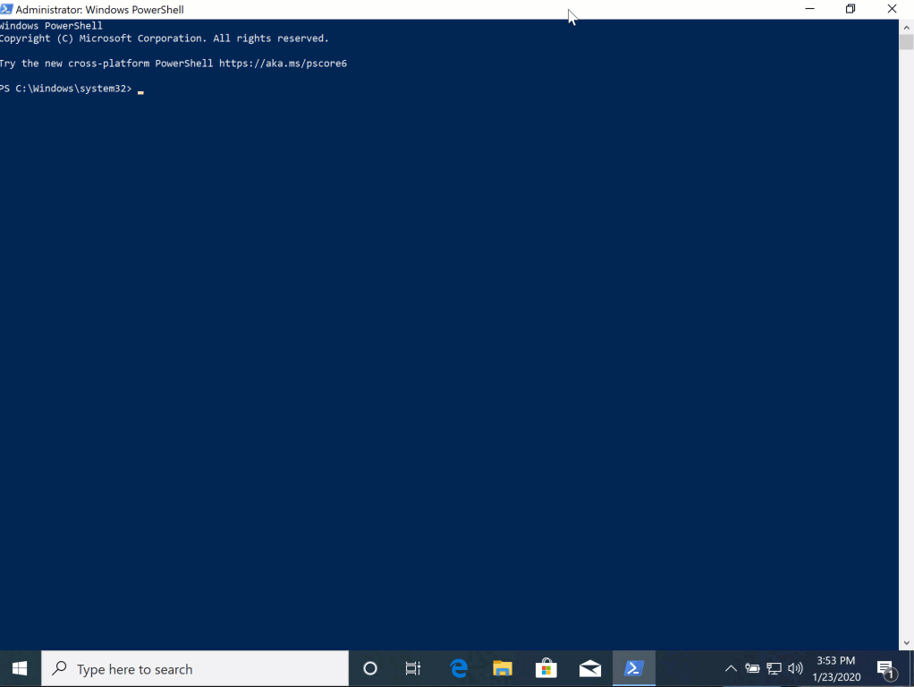
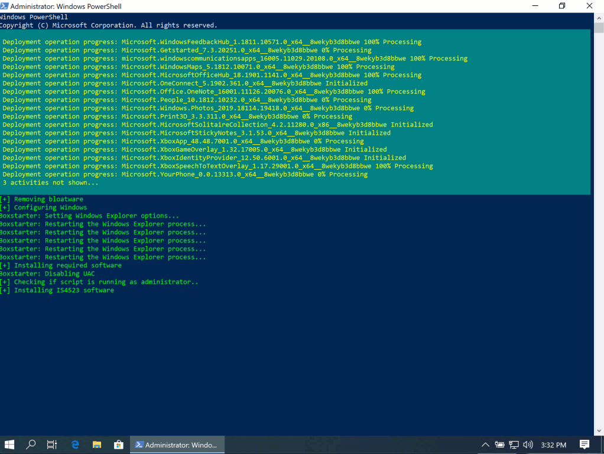

# Deploy IS4523 Software
This script was designed to configure a newly installed Windows 10 virtual machine for IS4523 (Digital Forensics II) classroom instruction. It will install all required software for the class.

You will need to either install Boxstarter or use the *DeployWin10VM* script.

## Legal and Licensing
This software is free to use and comes as is with no warranty. By downloading and running these scripts, you are accepting the risk of any misconfigurations, removal of software, or damages that may occur.

## Usage
Open Powershell (run as an adminstrator) 

Run the following command:

` . { Invoke-WebRequest -useb https://raw.githubusercontent.com/UTSA-cyber/DeployWin10VM/master/DeployCleanWin10.ps1 } | Invoke-Expression; Deploy-NewWindows10 -installPkg "https://raw.githubusercontent.com/UTSA-cyber/IS4523/master/IS4523-VMDeployment.ps1"`

## Output
This script will create a transcript for troubleshooting purposes. This should be located in the users Documents directory. 